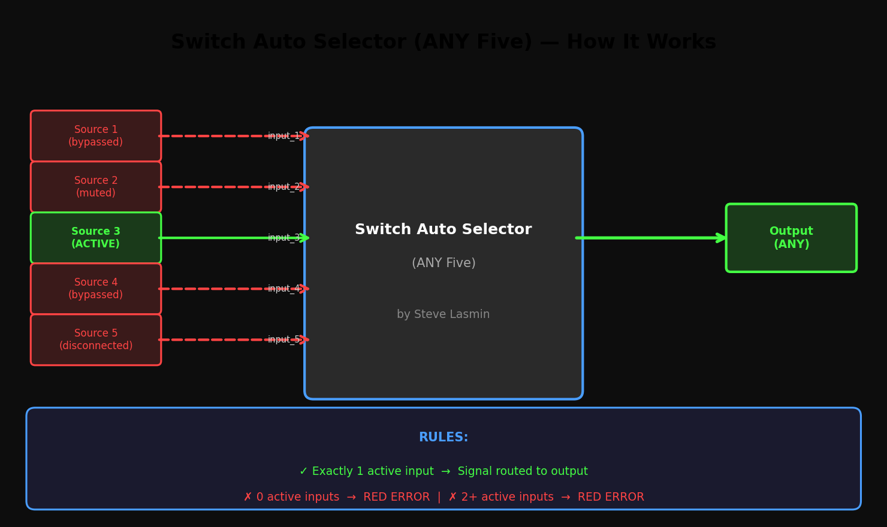

# Switch Auto Selector (ANY Five) by Steve Lasmin

A ComfyUI custom node that acts as an **exclusive single-source router**.



## Features

- **5 optional inputs** — all accept `ANY` type.
- **1 output** — dynamically matches the active input's type.
- **Auto-detection** — no manual index selection; the node finds the active signal automatically.
- **Strict validation** — raises a **red-node error** if:
  - **Zero** inputs carry data (all disconnected, bypassed, or muted).
  - **Two or more** inputs carry data (ambiguous routing).

## How It Works

Connect up to 5 sources to the inputs. **Bypass** or **mute** all sources except the one you want active. The node detects which single input is non-`None` and passes it through. If the count of active signals is not exactly **one**, execution halts with a clear error message.

| Active Inputs | Result |
|---------------|--------|
| Exactly 1 | Signal routed to output |
| 0 | **Red-node error**: *No active signal detected* |
| 2 or more | **Red-node error**: *Multiple active signals detected* |

## In-App Help

Hover over any input or output in ComfyUI to see tooltips. Right-click the node and choose **"Show Node Info"** (or press `Ctrl+I`) to view the full description and usage rules directly inside the canvas.

## Installation

### Via ComfyUI Manager
Search for **"Switch Auto Selector (ANY Five) by Steve Lasmin"** and install.

### Manual
```bash
cd ComfyUI/custom_nodes
git clone https://github.com/Eklipsis/switch-auto-selector-any-five-by-steve-lasmin.git
```

Restart ComfyUI after installation.

## Author

- **GitHub:** [Eklipsis](https://github.com/Eklipsis)
- **Comfy Registry:** `stevelasmin4real`
